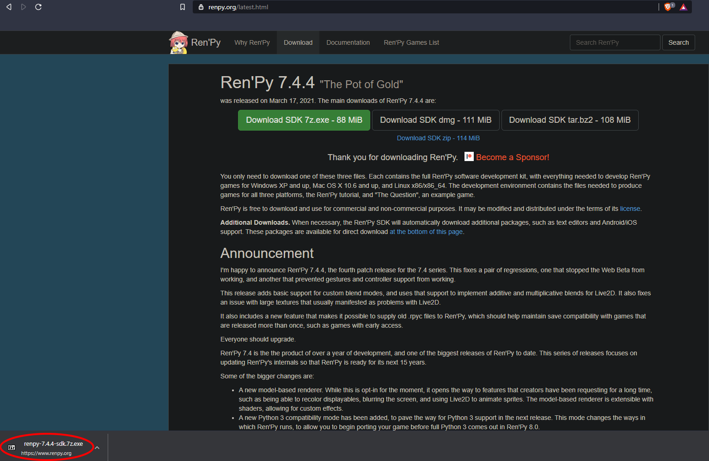
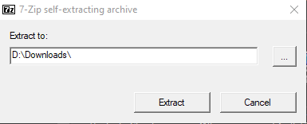
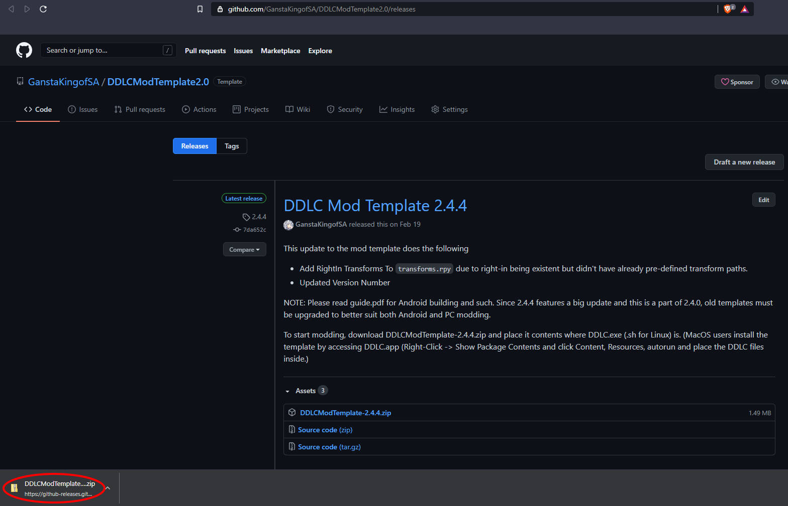
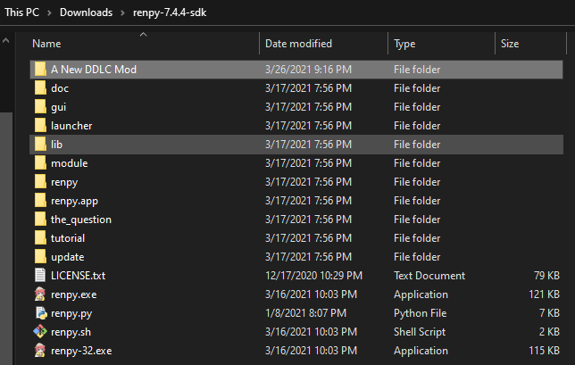
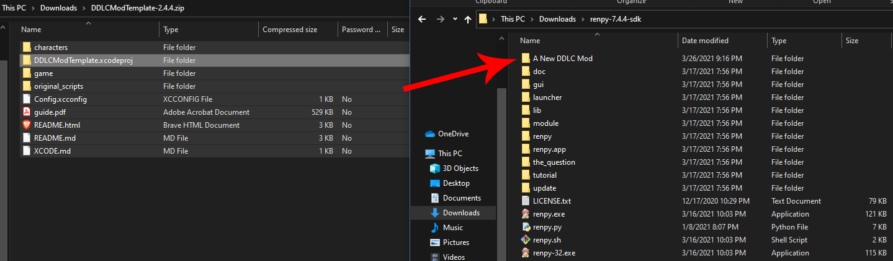
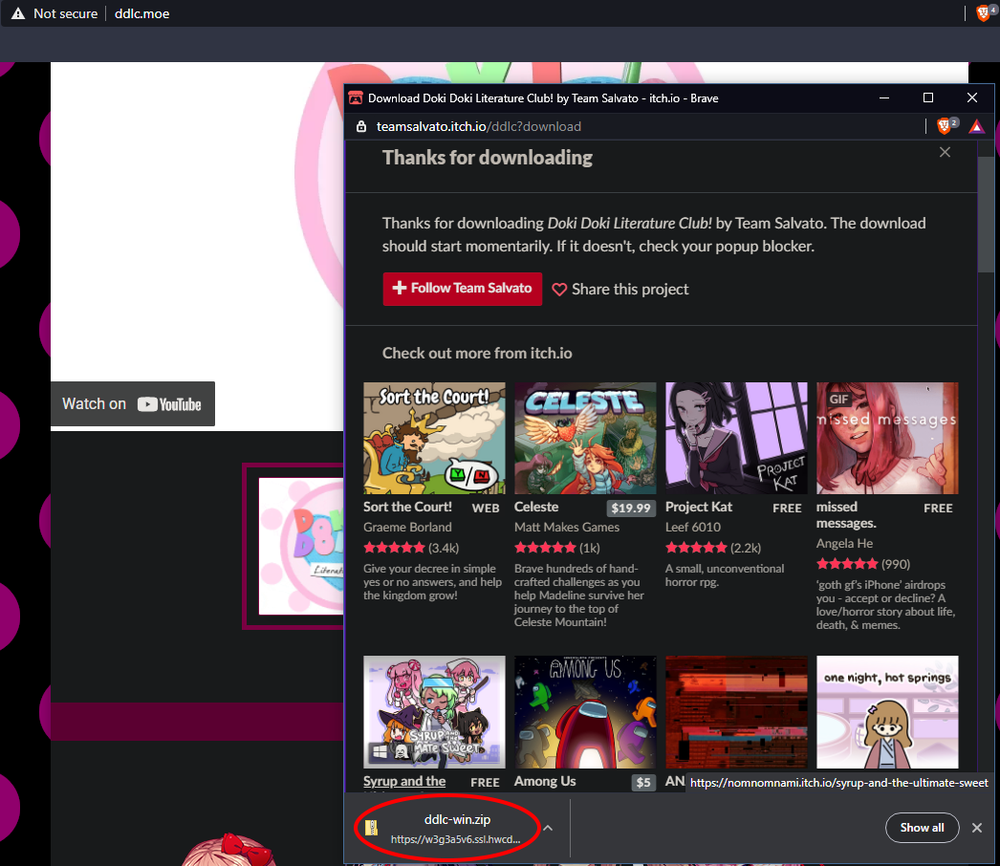
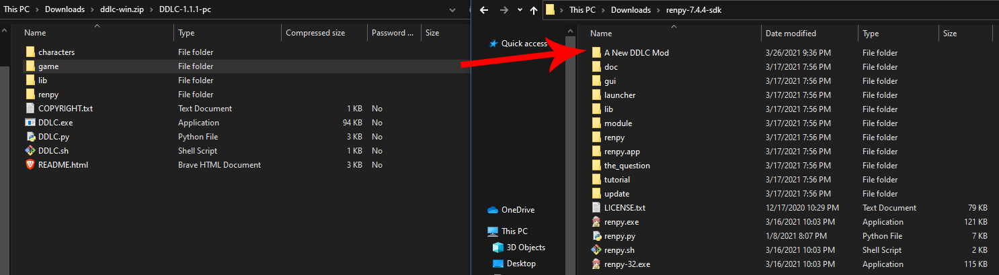
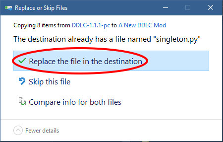
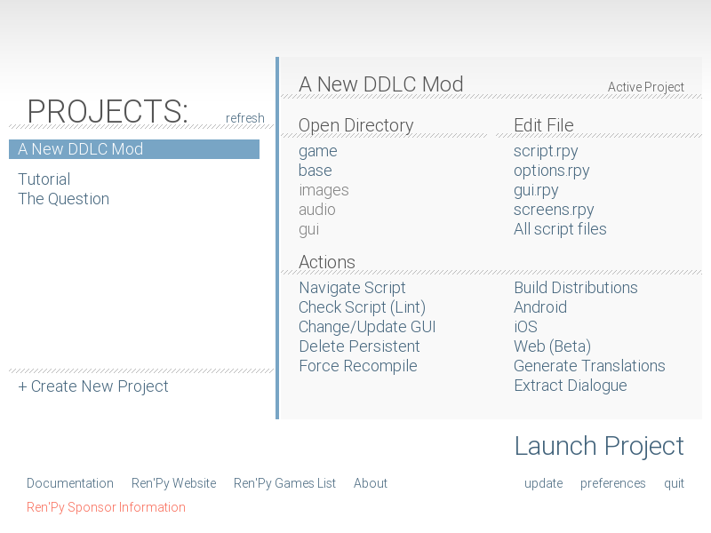

layout: page
title: "Installing the Mod Template - GanstaKingofSA's Github Page"
permalink: /information/installing-the-mod-template

[<-- Back to Information & Guides](guides.md)

# How to Install the Mod Template

This guide will show you how to install the mod template on a fresh copy of DDLC on Ren'Py 7.
> If you want to install the mod template on Ren'Py 6.99.12.4, see [How to Install the Mod Template (Legacy)](Installing-the-Mod-Template-Legacy.md)

## Requirements
1. A fresh copy of DDLC from [ddlc.moe](https://ddlc.moe).
2. A copy of the DDLC Mod Template from [my repository](https://github.com/GanstaKingofSA/DDLCModTemplate2.0/releases).
   > This guide will work with the Monika After Story/RationalPi template but it is recommended to upgrade to this template as the last update for this template was made over <u>**two**</u> years ago and lacks features compared to this one.
 3. The latest version of [Ren'Py](https://renpy.org/latest).

## Installation Steps

### Windows
1. Download the latest version of Ren'Py and run *renpy-7.4.4-sdk.7z.exe*

2. Select where to extract the `renpy-7.4.4-sdk` folder and press *Extract*.

3. Download the latest version of the DDLC Mod Template and open the ZIP file.

4. Go to the `renpy-7.4.4-sdk` folder, then make a new folder with the name of your mod. For this example, I named it *A New DDLC Mod*.

5. Highlight all of the files within the ZIP file and drag them to your newly created folder.

6. Download DDLC from DDLC.moe and open *ddlc-win.zip*

7. Highlight the `game` folder inside *DDLC-1.1.1-pc* and drag it to your created folder.

   > If you get a replace pop-up, just click *Replace the file in the destination*.
  
8. Open *renpy.exe* and click your mod folder under `Projects`.

And done! You are now ready to make your first script for your mod! 